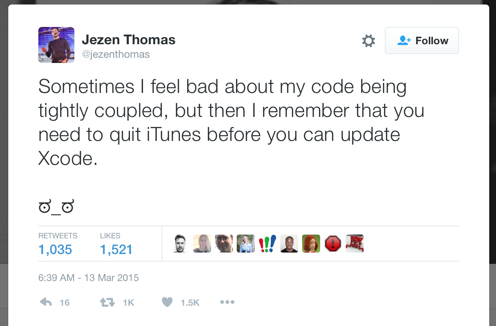

# CocoaHeads Conf

## *Francesco Perrotti-Garcia*

---

#[fit] *What's* good code*?*

# *and*

#[fit] **How do I write it**

---


#[fit] *Francesco* 
#[fit] *Perrotti-Garcia*
#[fit] iOS Developer
#[fit] **_@fpg1503_**

---

#[fit] Qualidade
#[fit] de código

---

#[fit] >> 🙋🙋‍♂️ <<

---

#[fit] Swift

---

#[fit] Testes

---

#[fit] Já escrevou
#[fit] código **ruim**

---

#[fit] Eu também

---

#[fit] >> 😅😅 <<

---

#[fit] Qualidade
#[fit] de código


---

#[fit] O que é?

---

#[fit] Código limpo

---

#[fit] Minha
#[fit] opinião

---

#[fit] Atemporal

---

#[fit] Agnóstico
#[fit] a arquiteturas

---

#[fit] 2 tipos

---

#[fit] > isoladamente

---

#[fit] > integrado

---

#[fit] > isoladamente

---

#[fit] Um trecho
#[fit] >> isolado <<


---

#[fit] > isolado

---

#[fit] Force unwrap

---

```swift
guard error == nil else {
	doSomething(with: error!)
}
```

---

#[fit] Diversos problemas

---

#[fit] Force unwrap

---

#[fit] Mas `error`
#[fit] sempre
#[fit] vai existir

---

#[fit] **Não** garantido
#[fit] pelo compilador

---

#[fit] Checar o **retorno**,
#[fit] não o erro

---

```swift
guard let value = value else {
	//error is still optional
}
```

---


```swift
guard let value = value else {
	doSomething(with: error) //accepts optional
}

```

---

#[fit] `(Any?, Error?)`
#[fit] é um **tipor ruim**

---

#[fit] `Result`

---

#[fit] `Result<[Person], Error>`

---

#[fit] 2 estados

---

#[fit] vs.

---

#[fit] 4 estados

---

#[fit] Tipos são
#[fit] **amigos**

---

#[fit] 💙💙💙

---

#[fit] Crie um tipo
#[fit] que te **atenda**

---

#[fit] Enum

---

#[fit] vs.

---

#[fit] Bools

---

#[fit] Code
#[fit] Style

---

#[fit] Code
#[fit] Smell

---

#[fit] SwiftLint

---

#[fit] Force try

---

#[fit] Legacy CG functions

---

#[fit] Weak delegate

---

#[fit] *Stringly*-typed
#[fit] APIs

---

#[fit] Segues, Cells

---

#[fit] Storyboard

---

#[fit] Natalie

---

#[fit] R.swift

---

#[fit] Swiftgen

---

#[fit] > integrado

---

#[fit] Protocolos

---

#[fit] `protocol`s

---

#[fit] Protocolos

---

#[fit] Protocolo
#[fit] grego: `πρωτόκολλον`
#[fit] latim: `Protocollum`

---

#[fit] >> 😂😂 <<

---

#[fit] Wikipedia

---

## `- Etiqueta`
## `- Diplomacia`
## `- Política`

---

## `- Ciência`
## `- Medicina`
## `- Comunicações`
## `- Criptografia`

---

#[fit] Protocolo
#[fit] **social**

---

#[fit] Estabelecimento
#[fit] de canal

---

#[fit] >> 👷🏻‍♀️🎅🏿 <<

---

#[fit] >> 🗣💬 <<

---

## > 👷🏻‍♀️: `Oi`
## > 🎅🏿: `Oi`

---

## > 👷🏻‍♀️: `Tudo bem?`

---

#[fit] 🎅🏿💭

---

#[fit] 🚸🎁 🇨🇳

---

#[fit] 💵⛽️📈

---

#[fit] 💸😰🎄

---

#[fit] 🤔🤔🤔
 
---

## > 🎅🏿: `Tudo ótimo!`
## > `E você?`

---

## > 👷🏻‍♀️: `Também!`
## > 🎅🏿: `Que bom!`

---

## > 👷🏻‍♀️: `<Fim>`
## > 🎅🏿: `<Fim>`

---

#[fit] Estabelecimento
#[fit] de canal

---

#[fit] O que é um
#[fit] **protocolo**?

---

#[fit] Acordo

---

#[fit] Conjunto de
#[fit] **Regras**

---

#[fit] **Facilitar**
#[fit] as coisas

---

#[fit] E o
#[fit] código?


---

#[fit] Exemplo:

---

#[fit] >> 🐥 

---

#[fit] `(Sim, isso é um pato)`

---

#[fit] Eu quero
#[fit] **um pato**!

---

#[fit] Para que?

---

#[fit] **Purpose**?

---


---

#[fit] Para que
#[fit] um **pato**?

---

#[fit] Patos fazem
#[fit] **quack**

---

#[fit] Ha!

---

#[fit] Você **não** quer
#[fit] um pato!

---

#[fit] Algo que faça
#[fit] **quack**

---

#[fit] Modelando
#[fit] meu **pato**

---

#[fit] Abordagem
#[fit] *"clássica"*

---

```swift
class Duck: Animal {
	func quack() {
		print("Quack, quack!")
	}
}
```

---

```swift
let myDuck = Duck(...)
myDuck.quack()
```

---

#[fit] Vamos fazer
#[fit] **diferente**

---

#[fit] `Quackable`

---

#[fit] Capaz de fazer
#[fit] **quack**

---

```swift
protocol Quackable {
	func quack()
}
```

---

```swift
let myQuackable = ...
myQuackable.quack()
```

---

#[fit] 🜎 Filosófico 🜎

---

#[fit] Se **faz quack**
#[fit] o que mais importa?

---

#[fit] *(nada)*

---

#[fit] **S**OLID

---

#[fit] Use protocolos

---

#[fit] Todo ViewController
#[fit] deveria ter um `delegate`

---

#[fit] Artigo
#[fit] @diogot

---

#[fit] Teste!

---

#[fit] >> 🛠🛠🛠 << 

---

#[fit] `public`
#[fit] **deve** ser testada

---

#[fit] Cobertura de teste
#[fit] **deve** ser 100%

---

#[fit] Componentes conversam
#[fit] pela interfaces

---

#[fit] SOLI**D**

---

#[fit] What is
#[fit] **code coverage**?

---

#[fit] Code Coverage

^ In computer science, code coverage is a measure used to describe the degree to which the source code of a program is executed when a particular test suite runs.

---

#[fit] De duas uma:

---

#[fit] Falta teste

---

#[fit] Sobrou código

---

#[fit] Falta teste:
#[fit] Adicionar mais testes

---

#[fit] Sobrou código:
#[fit] Apagar código inútil

---

#[fit] 🚨 **Não** 🚨
#[fit] saia apagando
#[fit] qualquer coisa!

---

#[fit] \(Use controle
#[fit] de versão)

---

#[fit] Partial functions

---

#[fit] Matt Gallagher
#[fit] @cocoawithlove

---

#[fit] TL;DR

---

#[fit] Quick, Nimble

^ BDD, Matchers

---

```swift
class TableOfContentsSpec: QuickSpec {
  override func spec() {
    describe("the 'Documentation' directory") {
      it("has everything you need to get started") {
        let sections = Directory("Documentation").sections
        expect(sections).to(contain("Organized Tests with Quick Examples and Example Groups"))
        expect(sections).to(contain("Installing Quick"))
      }

      context("if it doesn't have what you're looking for") {
        it("needs to be updated") {
          let you = You(awesome: true)
          expect{you.submittedAnIssue}.toEventually(beTruthy())
        }
      }
    }
  }
}
```

---

#[fit] SwiftCheck

---

#[fit] QuickCheck
#[fit] \(Haskell)

---

#[fit] \(nunca usei)

---

#[fit] Go

---

#[fit] go-proverbs.github.io
#[fit] @rob_pike 

---

#[fit] The **bigger** the interface,
#[fit] the *weaker* the abstraction.

---

#[fit] Quanto **maior** o
#[fit] **`protocol`**
#[fit] *menor* a abstração

---

#[fit] SOL**I**D

---

#[fit] optional 
#[fit] protocol
#[fit] requirements

---

#[fit] opcional
#[fit] ==
#[fit] facultativo

---

#[fit] > Swift tem um **bug**!

---

#[fit] > `@objc`

---

#[fit] 👎👎🏿👎🏻👎🏾👎🏼👎🏽

---

#[fit] Se é **opcional**
#[fit] deveria fazer parte
#[fit] do protocolo?

---

#[fit] `interface{}` 
#[fit] says **nothing**.

---

#[fit] `protocol<>` 
#[fit] não diz **nada**.

---

#[fit] `protocol<>`
#[fit] ==
#[fit] `Any`

---

#[fit] Protocolos estão
#[fit] no core de Swift

---

#[fit] Types matter

---

#[fit] Type safety


---

#[fit] Time

---

#[fit] Code review

---

#[fit] Meu primeiro
#[fit] **PR** rejeitado

---

#[fit] >> 😰😢😭 <<

---

#[fit] Danger

---

#[fit] Pair programming

---

#[fit] 👨‍❤️‍👨

---

#[fit] **Entender**
#[fit] o problema

---

#[fit] **Ninguém** escreve
#[fit] só código bom

---

#[fit] \(nem de primeira)

---

#[fit] Refactoring

---

#[fit] Playgrounds

---

#[fit] ThisCouldBeUsButYouPlaying

---

#[fit] Vida
#[fit] Real

---

#[fit] Quanto **tempo**
#[fit] o app vai viver?

---

#[fit] Done > Perfect

---

#[fit] "Premature Optimization is
#[fit] the root of all evil"

---

#[fit] Explicitar hacks

---

#[fit] //FIXME

---

#[fit] Explicativo

---

#[fit] Data

---

#[fit] HACKS.md

---

#[fit] eigen

---

#[fit] Ah!

---

#[fit] O **mito**
#[fit] do crash-free

---

#[fit] Crash-free
#[fit] **não** é tudo

---

#[fit] Escreva código
#[fit] **para humanos**

---

#[fit] Seja
#[fit] consciente

---

#[fit] >> 💡 <<

---

#[fit] >> 💉🚖💰 <<

---

#[fit] Conheça seu time

---

#[fit] Caso
#[fit] recente

---

#[fit] Kapeli

---

#[fit] Dash

---

#[fit] **Não**
#[fit] seja esse cara

---

#[fit] 💜💙💛💚

---



---

#[fit] Ou seja

---

#[fit] Automatize

---

#[fit] Compartilhe

---

#[fit] Reflita

---

#[fit] github.com/fpg1503/GoodCodeTalk

---

#[fit] Obrigado!

